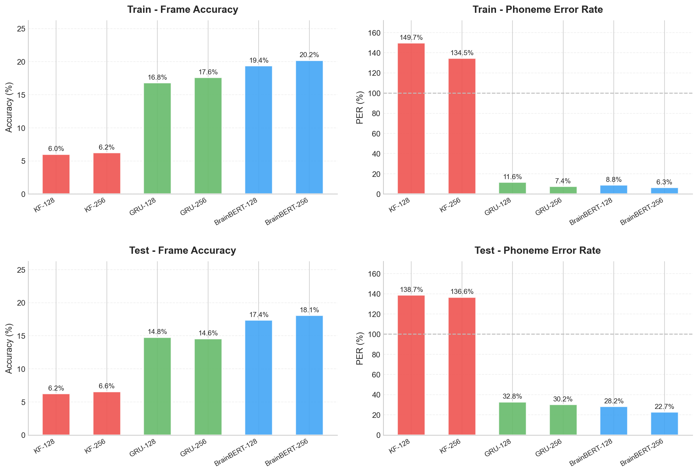
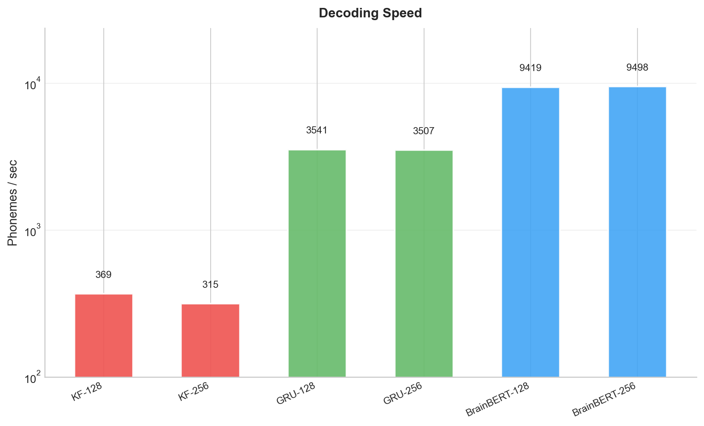
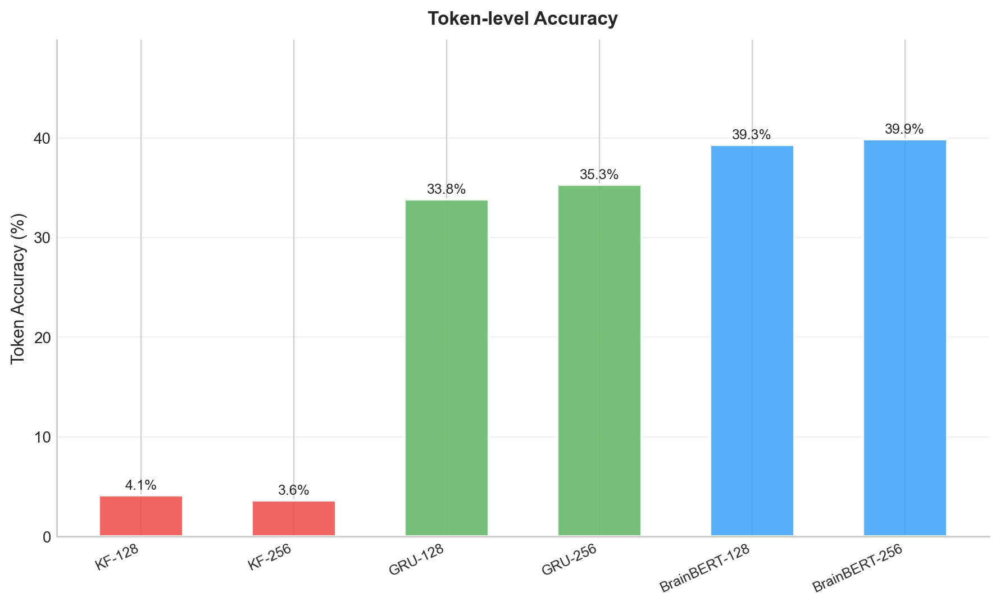

# BCI Phoneme Decoding Project

这是一个用于脑机接口（BCI）语音解码的实验项目，目标是从神经信号中预测音素序列，并比较不同建模方案的效果与速度。

项目当前重点对比了三类方法：
- `GLM`：线性/广义线性建模基线
- `GRU`：双向循环神经网络（CTC）
- `BrainBERT`：轻量 Transformer 编码器（CTC）

同时保留了 `KF`（Kalman Filter）作为传统方法对照，用于横向比较。

## Project Structure

主要目录说明：

- `GLM/`：GLM 训练与预处理代码
- `GRU_pro/`：GRU 改进版训练、预处理、测试脚本
- `BrainBert/`：BrainBERT 模型定义、训练、测试脚本
- `KF/`：Kalman Filter 相关训练与测试脚本
- `comparison/`：统一评估与绘图脚本、结果图
- `models/`：统一存放模型权重与参数文件（已整理）

`models/` 中按方法分组：

- `models/gru/`
- `models/brainbert/`
- `models/kf/`

## Environment

建议环境（按当前代码依赖）：

- Python 3.10+
- PyTorch
- TensorFlow（用于读取 TFRecord）
- NumPy / SciPy
- scikit-learn
- matplotlib
- editdistance
- tqdm

可按需安装：

```bash
pip install torch tensorflow numpy scipy scikit-learn matplotlib editdistance tqdm
```

## Data

代码默认读取本地 TFRecord 数据（示例）：

`D:\DeepLearning\BCI\Dataset\derived\tfRecords`

如果你的数据路径不同，请修改各训练/测试脚本中的 `BASE` 变量。

## How To Run

### 1) 训练模型

- GLM：`GLM/train_GLM.py`
- GRU：`GRU_pro/train_gru_pro.py`
- BrainBERT：`BrainBert/train_brainbert.py`
- KF：`KF/train_KF.py`

### 2) 模型对比与作图

运行：

```bash
python comparison/compare_all.py
```

将会生成：

- `comparison/chart1_train_test_comparison.png`
- `comparison/chart2_speed.png`
- `comparison/chart3_token_acc.png`

---

## Short Experiment Report (Based on comparison charts)

本次对比模型：`KF-128 / KF-256 / GRU-128 / GRU-256 / BrainBERT-128 / BrainBERT-256`。

### 1. Accuracy & PER（越高越好 / 越低越好）

从 `chart1_train_test_comparison.png` 可见：



- **Test Frame Accuracy**
  - KF: `6.2% / 6.6%`
  - GRU: `14.8% / 14.6%`
  - BrainBERT: `17.4% / 18.1%`
- **Test PER**
  - KF: `138.7% / 136.6%`
  - GRU: `32.8% / 30.2%`
  - BrainBERT: `28.2% / 22.7%`

结论：`BrainBERT-256` 在测试集上取得最佳识别质量（最高 Frame Acc、最低 PER）。

### 2. Decoding Speed

从 `chart2_speed.png` 可见（phonemes/sec）：



- KF: `369 / 315`
- GRU: `3541 / 3507`
- BrainBERT: `9419 / 9498`

结论：`BrainBERT` 在当前实现下速度最快，明显高于 GRU 和 KF。

### 3. Token-level Accuracy

从 `chart3_token_acc.png` 可见：



- KF: `4.1% / 3.6%`
- GRU: `33.8% / 35.3%`
- BrainBERT: `39.3% / 39.9%`

结论：在 token 级别，`BrainBERT` 同样最优；`GRU` 次之；`KF` 明显落后。

### 4. Overall Summary

- 在当前数据与预处理设置下，**BrainBERT（尤其 256 维）综合表现最好**。
- GRU 在准确率与错误率方面优于传统 KF，但略逊于 BrainBERT。
- KF 作为传统基线可提供参考，但在该任务上性能差距较大。

